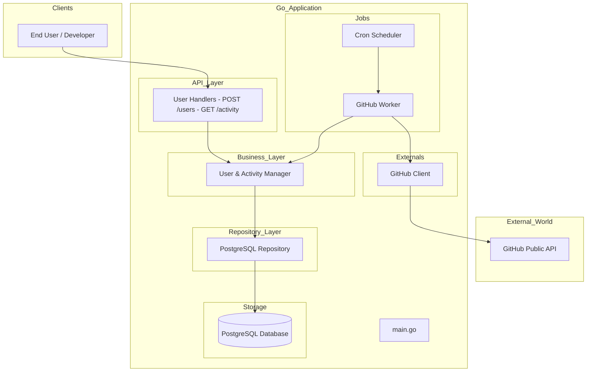

```mermaid
graph TD
    %% Define actors and external systems

    subgraph Clients
        U[End User / Developer]
    end

    subgraph External_World
        GAPI[GitHub Public API]
    end

    subgraph Go_Application
        M[main.go]

        subgraph API_Layer
            EH[User Handlers - POST /users - GET /activity]
        end

        subgraph Business_Layer
            BL[User & Activity Manager]
        end

        subgraph Repository_Layer
            RP[PostgreSQL Repository]
        end

        subgraph Storage
            DB[(PostgreSQL Database)]
        end

        subgraph Jobs
            CR[Cron Scheduler]
            GW[GitHub Worker]
        end

        subgraph Externals
            GC[GitHub Client]
        end
    end

    %% Flow
    U --> EH
    EH --> BL
    BL --> RP
    RP --> DB

    CR --> GW
    GW --> BL
    GW --> GC
    GC --> GAPI
```
