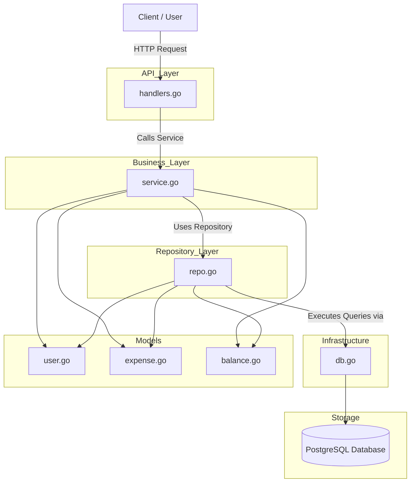

## Architecture Diagram

---

## Architecture Overview

This project follows a layered architecture to ensure separation of concerns, maintainability, and scalability. Each layer has a clearly defined responsibility and interacts only with adjacent layers.

### API Layer (`api/handlers.go`)

The API layer is responsible for handling HTTP requests and responses. It parses incoming requests, validates input, and delegates the actual work to the business layer.

Why it is needed:

* Prevents external request handling logic from mixing with core application logic
* Makes it easier to change API formats (e.g., REST to GraphQL) without affecting other layers
* Acts as a clear boundary between the outside world and the system

---

### Business Layer (`business/service.go`)

The business layer contains the core application logic. It enforces rules, performs validations, and orchestrates workflows.

Why it is needed:

* Centralizes all business rules in one place
* Prevents duplication of logic across multiple handlers
* Makes the system easier to test since it does not depend on HTTP or database details

In real-world systems, requirements change frequently. Having a dedicated business layer ensures changes can be made in one place without breaking other parts of the application.

---

### Repository Layer (`repository/repo.go`)

The repository layer handles all interactions with the database. It abstracts the data access logic from the rest of the application.

Why it is needed:

* Decouples business logic from database implementation
* Makes it easier to switch databases (e.g., PostgreSQL to MongoDB)
* Enables easier unit testing by mocking database interactions

Without this layer, SQL queries would be scattered across the codebase, making maintenance difficult.

---

### Infrastructure Layer (`infra/db.go`)

The infrastructure layer is responsible for setting up and managing external dependencies such as database connections.

Why it is needed:

* Centralizes configuration and connection logic
* Avoids duplication of setup code across the application
* Makes it easier to manage different environments (development, staging, production)

---

### Models (`models/`)

The models layer defines the core data structures used throughout the application, such as users, expenses, and balances.

Why it is needed:

* Provides a consistent data structure across all layers
* Ensures type safety and reduces runtime errors
* Acts as a contract between different parts of the system

---

### Storage (PostgreSQL)

The storage layer represents the actual database where data is persisted.

Why it is needed:

* Provides durable and structured data storage
* Supports querying, indexing, and relationships between entities

---

## Request Flow

1. A client sends an HTTP request to the API layer
2. The API layer parses the request and calls the business layer
3. The business layer processes the request and applies application logic
4. The business layer calls the repository layer for data operations
5. The repository executes queries via the infrastructure layer
6. The infrastructure layer communicates with the PostgreSQL database
7. The response flows back through the same layers to the client

---

## Benefits of This Architecture

* Clear separation of concerns
* Easier to maintain and extend
* Improved testability through layer isolation
* Flexibility to change database or external systems
* Scalable structure suitable for real-world applications
